From: RWWilliams, rwilliams\@uthsc.edu, labwilliams\@gmail

To: Many (and now about ready for a blog)

Date: 14Feb2021

Version: Extended cut of 15Feb2021 v2

Dear colleagues (particularly those interested in alcohol and drug
addiction, brain proteomics, dopamine, causal modeling),

You could either go tobogganing today or tomorrow OR learn a bit about a
cool new rat brain proteomics-genetics data set generated by Xusheng
Wang (University of North Dakota) and colleagues, including Jumin Peng
at St. Jude Children\'s Research Hospital, and Michal Pravenec at the
Czech Academy of Science. This is an open, but not yet final,
quantitative proteomics data for the whole brain for 21 strains of rat
(male and female isogenic littermates) from the HXB/BXH family--part of
the Hybrid Rat Diversity Panel.

For those of you on this list at NIH, first, thank you for all of your
support over more than 20 years that has made this Valentine\'s primer
possible--starting with the NIH Human Brain Project and continuing now
with a NIDA P30. I hope you will be impressed not only by the data that
Xusheng generated, but by the FAIR-ness and ease of analysis of highly
valuable smart quadratic data.

What the heck is *smart quadratic data*? Please see an extended
discussion on this topic (verging on a soap box rant in sections) given at the
University of Virginia in the Data Science program, 20Nov2020:
 ***<https://youtu.be/4ZhnXU8gV44> ***

> **Footnote on this presentation**: Do you wonder why translation fails
> from animal models to human clinical care? 1-N-der? NIH has funded *n
> = 1* biomedical experimental research for about 70 years without
> blinking. Anyone who read Roger J. Williams\'s *Biochemical
> Individuality* when it came out in 1956 should have known better
> (***https://en.wikipedia.org/wiki/Roger_J._Williams***). My excuse
> is that I was four years old, Elias Zerhouni was 5 years old, Francis Collins was 6 years old.
> Eric Lander was about -9 months old. 
> But James Shannon was 52 years old. It is now 2021 and in this
> glorious \"post-genomics\" era of highly accurate personalized health
> care and prevention (NOT) we should grow up and embrace the diversity
> and complexity of living systems. *Necessary and sufficient*--only in
> your reductive dreams. Want more of this: see *Herding Cats--the
> Sociology of Data Integration*, 2009: PMID: 20228863
> https://doi.org/10.3389/neuro.01.016.2009

Many of you have given talks with a hierarchy of traits. I remember a
lovely talk that Nora Volkow gave to the Human Brain Project teams in
about 2005--from gene variants at the bottom to variable outcome
measures at the top--susceptible vs resistant, fast vs slow
metabolizer, will relapse, won\'t replase. I would say we have made only
modest progress at true holistic integration, and few biomedical
researcher know much about causal quantitative modeling. We absolutely
need the proteome tier to model addiction, and we need proteomes from
dozen of brain regions and hundreds is not thousands of individuals to
model risk and make reasonable predictions. Otherwise we are just
flapping our hands and lips. The work by Xusheng and others shows that
we are finally ready to come out of the proteomics \"winter\". The
technolgy is mature; batch effect is well controlled; cost is about the
same as Affymetrix arrays were in 2005. Several new proteomic data sets
in GeneNetwork prove it, but only Xusheng\'s data is directly relevant
to addiction.

End of context; on with the topic at hand:

One small molecule of great fame--DOPAMINE--and its modulation,
variation, and contribution to addiction

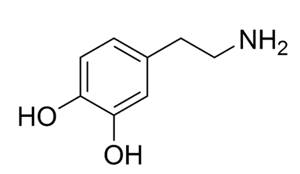

QUESTION: 

> **What proteins related to dopamine and its many roles in behavior are
> strongly modulated by DNA variants, and can we determine what gene
> variants are related both to dopamine function and substance use
> disorders. **
>
> The Red Hot Chili Peppers ask this question in *This is the Place.*
>
> \"[Can I isolate your gene? Can I kiss your
> dopamine?](https://genius.com/Red-hot-chili-peppers-this-is-the-place-lyrics#note-1422525)
>
> \...
>
> A master piece of DNA caught in a flashing ray\"
>
> (The lyrics are* *on the horror of drug addiction. The lead, Anthony
> Kiedis, has relapsed several times. The PG version of the
> song: ***<https://www.youtube.com/watch?v=gqgm7ViA2Ag>  ***and the
> typical RHCP shirtless version for the cool
> kids:*** <https://www.youtube.com/watch?v=8Dkvwu3aWkY>***

**Step 1. **To answer the BIG Question, we are going to review all
genes/proteins in NCBI **Gene Reference into Function**---RIF for
short---that are related in some way to *dopamine*. 

There are two ways to do this:

1\. Link
to [***https://www.genenetwork.org***](https://www.genenetwork.org) and
set up the **Select and search **screen to look as shown below:

Note that in the **Combined** field above, I have entered the string

> **RIF=dopamine   LRS=(15 999)** 

This string will retrieve all proteins in the Hybrid Rat Diversity Panel
(the HXB/BXD family in this specific case) that are expressed reasonably
well (just over 8,000 proteins and over 200,000 peptide fragments) in
the whole brain.  

The second part of the search string (LRS\...) finds all proteins that
have strong linkage---a likelihood ratio statistic score of at least 15.
This is equivalent to a LOD score of 3.3, and this is a value that is
often close to the genome-wide significance level. The other value, 999,
is just a high upper limit.

The second way to find these proteins is a bit easier---just paste this
URL into your browser:

> [***https://genenetwork.org/search?species=rat&group=HXBBXH&type=Whole+Brain+Proteome&dataset=UND\_NIDA\_HXB-BXH\_WBPr\_log2z8\_0221&search\_terms\_or=&search\_terms\_and=RIF%3Ddopamine+LRS%3D%2815+999%29&FormID=searchResult***](https://genenetwork.org/search?species=rat&group=HXBBXH&type=Whole+Brain+Proteome&dataset=UND_NIDA_HXB-BXH_WBPr_log2z8_0221&search_terms_or=&search_terms_and=RIF%3Ddopamine+LRS%3D%2815+999%29&FormID=searchResult)

(This link can be shared, and will work *in perpetuity throughout the
known universe; *I phrase I steal from the Walt Disney Company legal
department with trepidation.)  

**Step 2**. At this point if you are following along, you should have a
list of 115 proteins that are abundantly expressed in brain AND are
linked to *dopamine* AND that have reasonable genetic linkage in the HXB
family to a particular genome coordinate (usually a SNP). The **Search
Results** table should look like the screenshot below. 

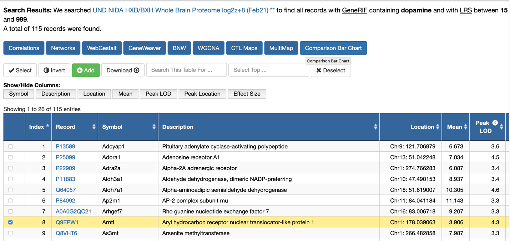

I have highlighted the row 8---the ARNTL protein---a major transcription
factor involved in circadian rhythms that is upregulated by DRD2
signaling (PMID: 16606840 in PNAS 2006)

**Step 3.** To begin to answer the second question---is there a major
modulator of multiple dopamine-associated proteins---we need to re-sort
this table using the column labeled **Peak Location**. In this
screenshot below I have scrolled over to the right to display the **Peak
Location** column after having performing the sort. All of these
proteins map to Chr 1 at about 43.7 megabases (Mb).

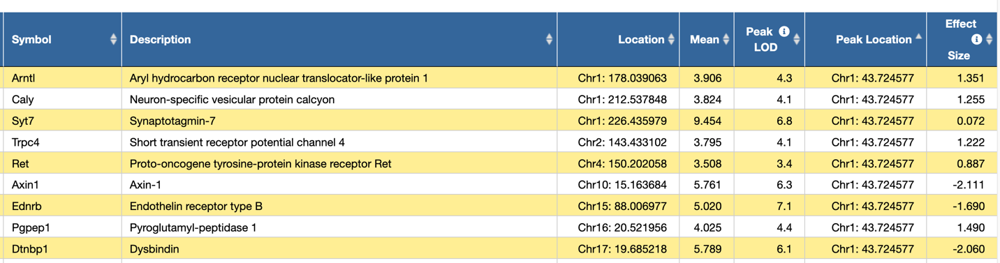

We see ARNTL again and eight other proteins that are genetically
downstream of one or many DNA variants located on the proximal part of
chromosome 1 (Chr 1). The **Peak LOD** scores range between 4.1 and 7.1.

If you scroll down this list (and you should), you will find another
region of the rat genome that is highly linked with dopamine-associated
proteins---Chr 19 at about 60 Mb. But before we head to Chr 19, let\'s
continue to work with this proximal part of Chr 1 and try to figure out
why the variation in expression of this band of nine proteins map to
this part of the rat genome. Step 3 below is a long step---my
apology, sorry. Perhaps time for a coffee break.

**Step 3** involves mapping one or more of these nine proteins. I will
pick SYT7 since it has the highest expression (9 log2 units of
expression) and the second highest LOD score (6.8).

You can either click on the UNIPROT identifier---**Q62747 **in the
window, or you can just paste this URL command into a browser:

> [***https://genenetwork.org/show\_trait?trait\_id=Q62747&dataset=UND\_NIDA\_HXB-BXH\_WBPr\_log2z8\_0221***](https://genenetwork.org/show_trait?trait_id=Q62747&dataset=UND_NIDA_HXB-BXH_WBPr_log2z8_0221)

If all goes well, your browser will display this content (and much more
too):

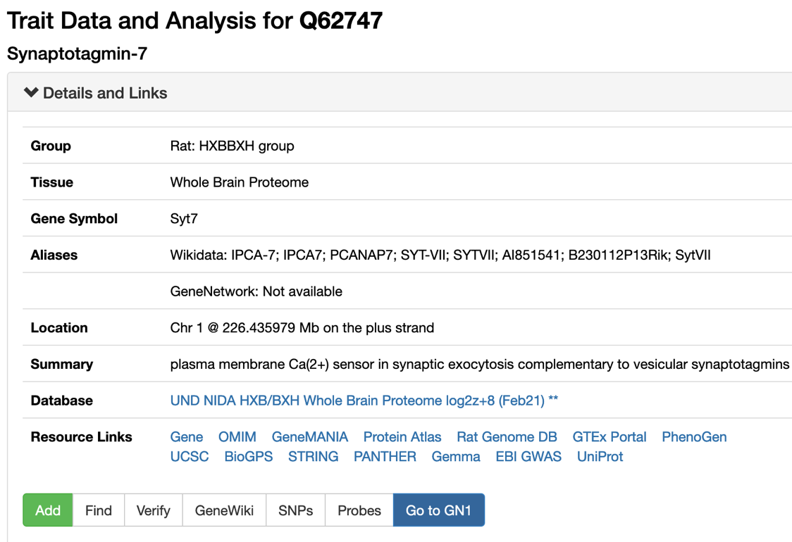

Before we map SYT7 protein expression, you may be curious to know how
this protein has been linked to dopamine. 

The answer is one click away. Tap on the **GeneWiki** button,
highlighted below in grey.

A **GeneWiki** window will open, and RIF number 18 explains the
association with *dopamine* and also links to a 2011 paper (PMID
21576241) on somatodendritic dopamine release and the involvement of
synaptotagmin 7 (SYT7).\
\
Again we pause briefly for \"data due diligence\". In the **Statistics**
**histogram** window you will note that the distribution of SYT7 protein
levels in 21 strains has a hint of bimodality---that is a good thing.

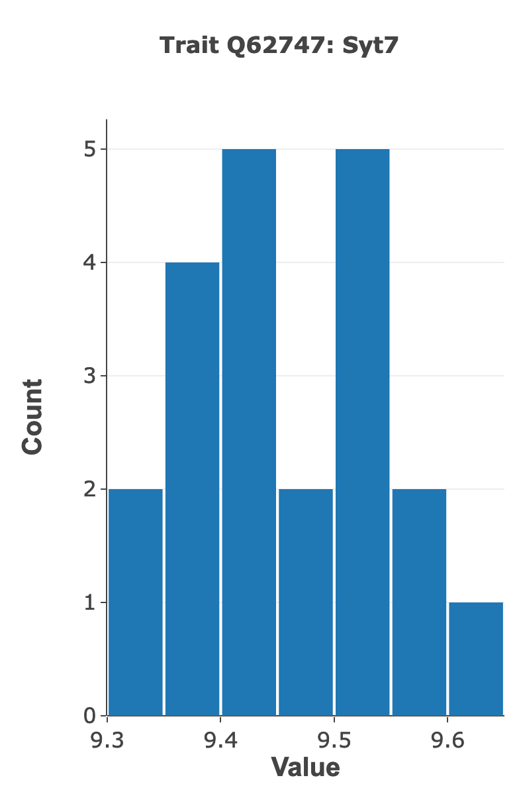

There are no outliers, so we can map these logged protein expression
data \"as given\" without further normalization.

We can now finally proceed to the actual mapping of variation in protein
expression---using for the first time infinite marker maps for
chromosome of all of the HXB/BXH family, and using the
updated GEMMA linear mixed model mapping function in GeneNetwork.

Open the **Mapping Tools** window

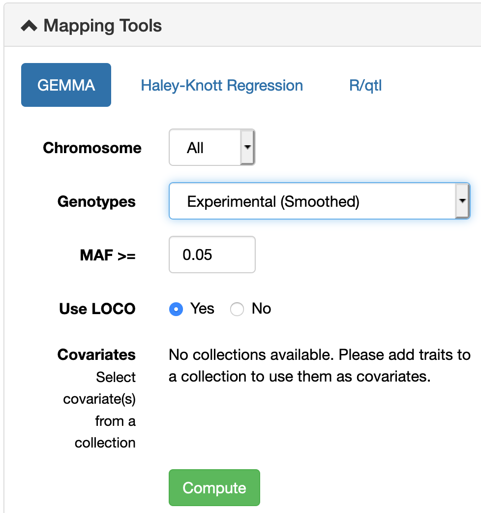

In the screenshot above I have mapped variation in SYT7 protein level
using the new **Genotypes file: Experimental (smoothed)**

These are genotypes based on whole genome sequencing of the HXB/BXH
family using linked-read 10X Chromium DNA libraries at a mean sequence
coverage of just over 45X. Libraries were prepared at HudsonAlpha and
sequenced on an Illumina Novaseq across the street from NIH at *The
American Genome Center* (TAGC, thanks Michal, Melinda, Hao, Clifton,
Jonathan, David, Hakan, Tristan, Victor, Jun, many others\....).

The Manhattan plot of variation in SYT7 protein expression should look
like this: 

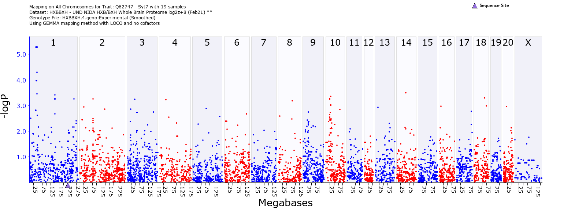

Beneath the Manahattan plot there is a **Mapping Statistics** table that
provides estimates a SNP coordinates (Rnor6 assembly) calculated by
GEMMA with -logP values and additive effects (log2 scale).

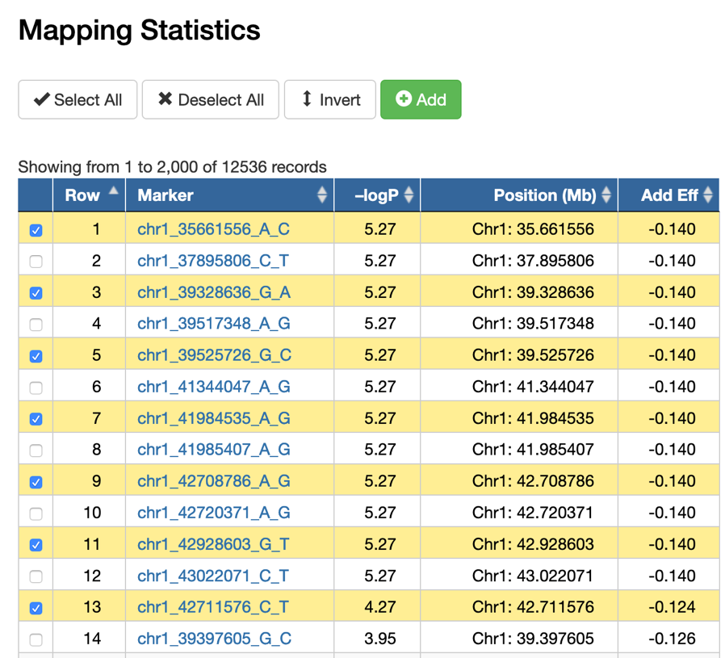

A -logP value of 5.27 is good---normally at or above genome-wide
threshold of significance. (This assertion does need more support, and
we are testing thresholds using using other mapping methods, including
R/qtl\'s and WebQTL\'s standard interval mapping methods, and using
permutation tests.)

**Step 4.** What is the approximate confidence interval of the SYT7
protein expression quantitative trait locus (QTL) on Chr 1? To answer
this question we need to sort the **Mapping Statistics** by
the **Position** column. Once sorted, we have to decide how wide a
confidence interval is appropriate given the density of DNA variants,
gene density, and -logP values. Karl Broman and others recommend a drop
in the --logP linkage statistic of about 1.5 on either side of the peak,
or plateau in this case. For the QTL map of SYT7 the confidence interval
encompasses an stretch of DNA from about 35 megabases (Mb) to 43 Mb.

Normally, in an interval this large, we would just hit the pause button
and spend more time increasing the sample size (in progress already by
Xusheng Wang and colleagues). But for the sake of this Valentine\'s day
email, I am going to forge ahead to get to the box of chocolates and
that essential dopamine kiss in nucleus accumbens that is so rewarding.\
\
**Step 5**. What genes are located along this part of Chr 1? 

To answer this question, click on the chromosome number, **1** in this
case.

This will generate a chromosome-specific view; part shown below.

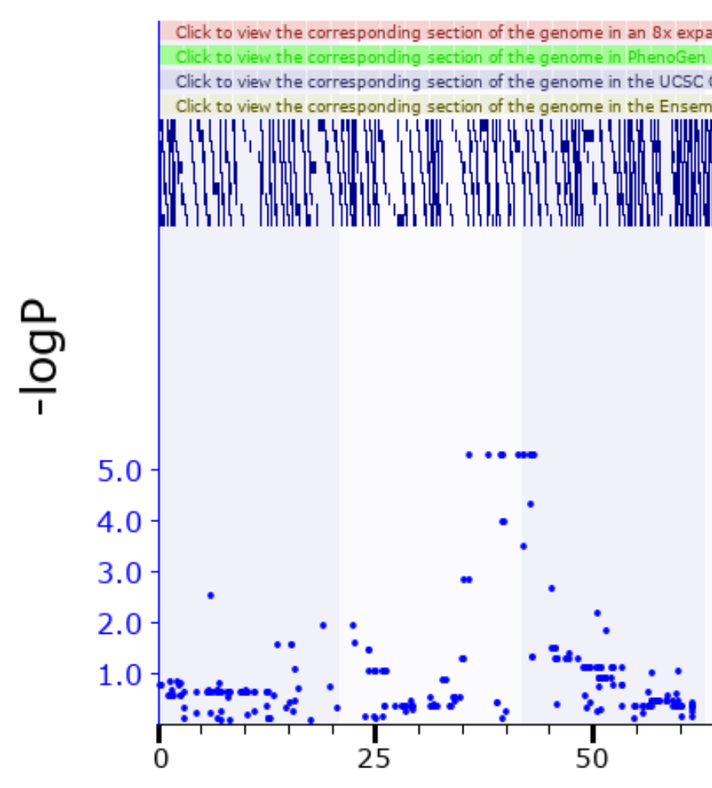

The QTL peak is a \"non-recombinant\" plateau that extends from 35.5 to
45 Mb---confirming visually what we had already determined from the
--logP values.  The blue blocks along the top are gene \"models\" and
the lighter blue dots are the linkage values at different SNP locations.
You can zoom to a map with specific start- and end-coordinates. 

You can keep zooming in on a specific region of a chromosome by clicking
on the pink horizontal bar alonge the top. Here is the plateau region of
the SYT7 protein expression QTL.

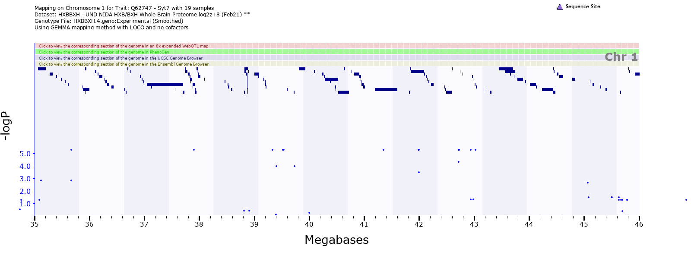

As you can tell from the screenshot, there are lots of genes---real and
putative---that call this part of Chr 1 home.

Underneath each map an **Interval Analyst** table of all genes and
pseudogenes in a specific interval. In this case, there are about 130
gene, of which 32+ are protein-coding. 

Let me list them out throught to about 44 Mb.

ADAMTS16 

ICE1 

MED10 

UBE2QL1 

NSUN2 

SRD5A1 

PAPD7 

ADCY2 

FASTKD3 

MTRR 

ZFP874B 

ZFP748 

PPP1R14C 

IYD 

PLEKHG1 

MTHFD1L 

AKAP12 

ZBTB2 

RMND1 

ARNTL1 

ESR1 

SYNE1 

MYCT1 

VIP 

CCDC170 

FBXO5 

MTRF1L 

RGS17 

OPRM1 

IPCEF1 

CNKSR3 

Anything catch your eye? Actually, lots to catch the eye
here---perhaps too much. 

The gene/\'protein that most of you will catch is **OPRM1**---the mu
opioid receptor. 

Variants in this gene and locus are definitely controllers of morphine
response---particularly so in the BXD mouse family (Paige Lemen, Hao
Chen, Guy Mittleman, and Price Dickson have a strong abstract on this at
the upcoming 2021 NIDA Genetics meeting). Also true in *Homo sapiens*
based on initial GWAS analysis.\
\
**Step 6**. How do we evaluate the strength of these candidates as
controller of some subset of the nine proteins with variable expression
that map to this region?

Simple---clip out all of those positional candidate genes and paste them
into the search **Get Any** window of GeneNetwork. It should look like
this:

 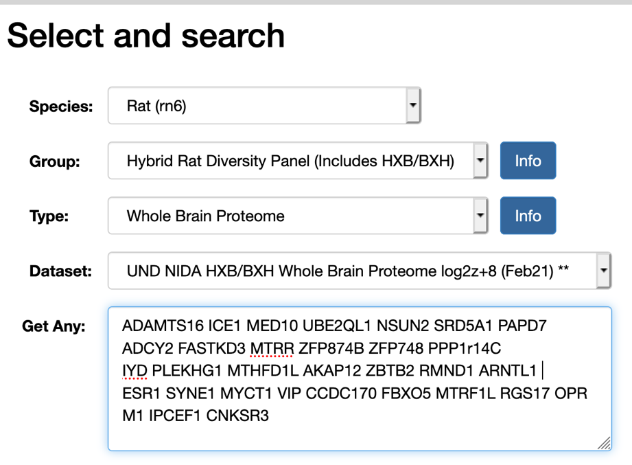

About 12 of these proteins have reasonably high expression in the rat
brain, and three of these also are associated with reasonably strong
cis-acting modulation---FASTKD3, PPP1R14C, and MTRR. That means that DNA
variant in or around these genes modulate both mRNA expression but much
more importantly, also the protein level.

You can review these three candidates at your leisure. 

PPP1R14C (aka KEPI)---see PMID: 11812771

MTRR: not much related to CNS function---mainly cancer and development

FASKD3: not much CNS but key in mitochondrial function

Ok, time to go out and sled.

Any one that made it this far---bravo---you have persistence.

Any questions about the proteomics to Xusheng Wang.

Any questions about the genotypes and HXB sequence to Hao Chen.

Any questions about mapping to Pjotr Prins and me.

Any questions about GeneNetwork user interface to me.

> [[Can I isolate your gene? Can I kiss your
> dopamine?]{.underline}](https://genius.com/Red-hot-chili-peppers-this-is-the-place-lyrics#note-1422525)\....
>
> A perfect piece of DNA caught in a flashing ray
>
> A master piece of DNA caught in a flashing ray

Thanks RHCP for thinking of us NIDA- and NIAAA-funded genetics
researchers.

\-- 

Rob

ps. You may want to know about OPRM1 as a great position and biological
candidate gene---is it causal. Unfortunately expression is not
consistently high in this proteomics analysis and we will have to look
at bit harder to find peptide fragments for this protein. Coming soon to
a webservice near you.
