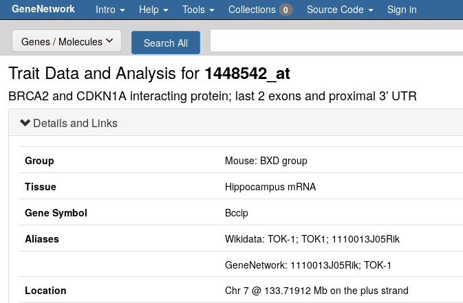

# Storyboard: starting from a known gene

GeneNetwork contains data on thousands of experiments. How do you mine GN when you have the name of a gene? Let us start with `BRCA2`.

## Find the right name

GeneNetwork knows about aliases. But sometimes you want to check what aliases there are in mouse. If you search for BRCA2 and click on a search result, for example for [1448542_at](http://genenetwork.org/show_trait?trait_id=1448542_at&dataset=HC_M2_0606_P),
you get to the 'trait page' which shows the aliases:

  

