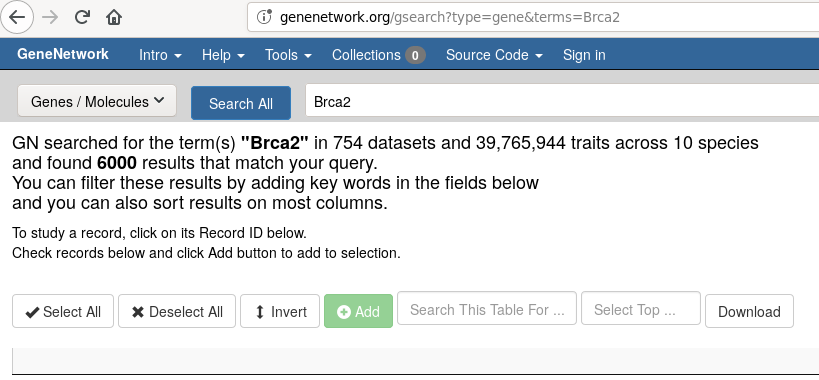

# Storyboard: starting from a known gene

GeneNetwork contains data on thousands of experiments. How do you mine GN when you have the name of a gene? Start with [BRCA2](https://genenetwork.org/genes/BRCA2).

## Use the search page

The top bar of GeneNetwork shows a global search. We can look for the `Brca2` mouse gene:

  

## Find the right alias/name

GeneNetwork knows about aliases. But sometimes you want to check what aliases there are in mouse. If you search for BRCA2 and click on a search result, for example for [1448542_at](http://genenetwork.org/show_trait?trait_id=1448542_at&dataset=HC_M2_0606_P),
you get to the 'trait page' which shows the aliases:

  

GeneNetwork ignores case by default. In a search use quotes to search case sensitive. For example,  [BRCA2](https://www.wikidata.org/wiki/Q17853272) on wikidata.org refers to the human gene. The mouse gene is named [Brca2](https://www.wikidata.org/wiki/Q14864738).

## Find the GeneNetwork genewiki entry

TBD
