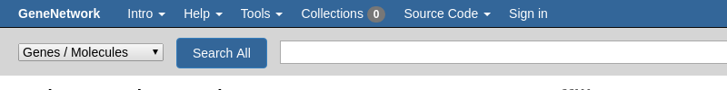
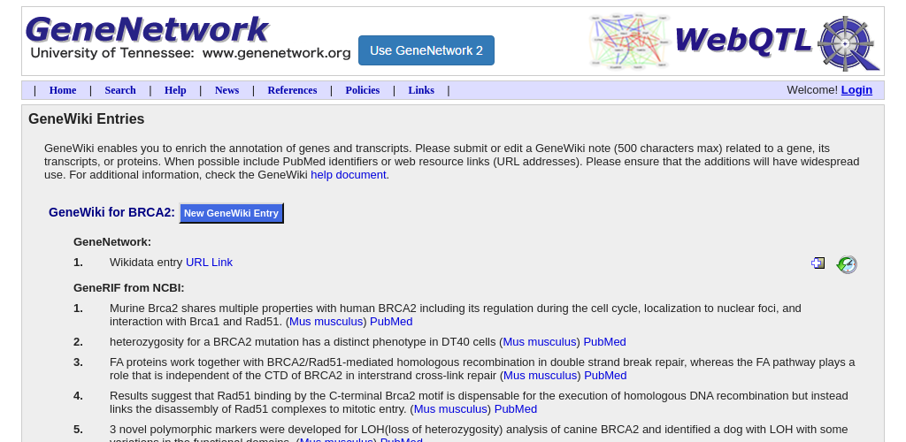
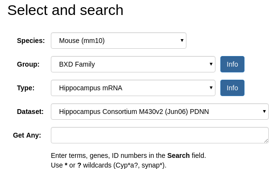
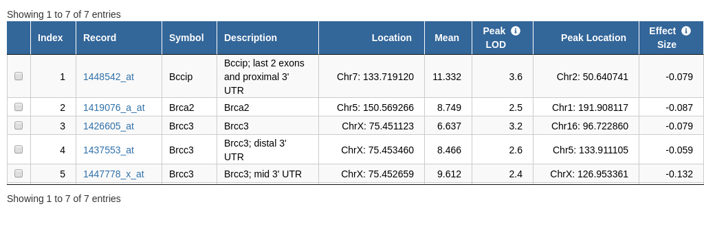
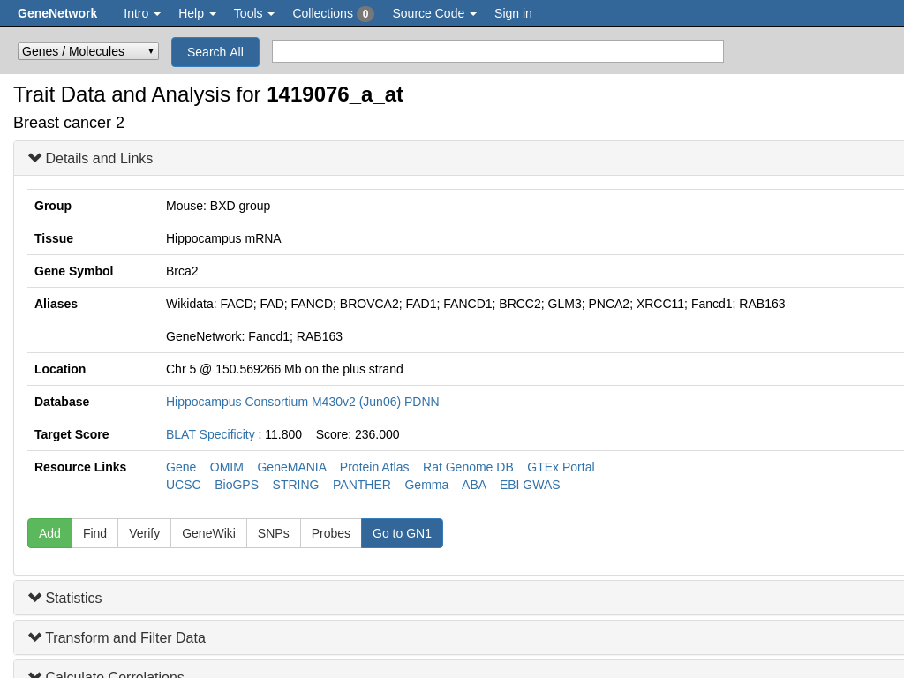

# Storyboard: starting from a known gene

GeneNetwork contains data on thousands of experiments. How do you mine GN when you have the name of a gene? Start with [BRCA2](https://genenetwork.org/genes/BRCA2).

# Use the search page

The top bar of GeneNetwork shows a global search:

We can look for the `Brca2` mouse gene, resulting in

FIXME: @zsloan above image should show a table of results too, see https://github.com/genenetwork/genenetwork2/issues/629

# Find the right alias/name

GeneNetwork knows about aliases. But sometimes you want to check what aliases there are in mouse. If you search for BRCA2 and click on a search result, for example for [1448542_at](http://genenetwork.org/show_trait?trait_id=1448542_at&dataset=HC_M2_0606_P),
you get to the 'trait page' which shows the aliases:

GeneNetwork ignores case by default. In a search use quotes to search case sensitive. For example,  [BRCA2](https://www.wikidata.org/wiki/Q17853272) on wikidata.org refers to the human gene. The mouse gene is named [Brca2](https://www.wikidata.org/wiki/Q14864738).

# Find the GeneNetwork genewiki entry

GeneNetwork maintains info on gene entries. For example on the above trait page for 1448542_at/BRCA2 the [genewiki] button takes you to:

FIXME: @zsloan we aim to move this functionality to GN2/markdown

# Looking experiments that

On the GN home page we find advanced search routines

In the 'Get any' box type `BRCA2' and hit [Search] to find all traits that mention Brca2 for the matching datasets (here Hippocampus mRNA) resulting in

So, for this dataset 7 results are shown with interesting QTL scores.

Click on the trait `1419076_a_at` that is annotated as `Brca2` on Chr5: 150.569266  with a QTL on Chr1: 191.908117 and we get to the powerful mapping page

As we picked this trait from an RNA dataset 1419076_a_at likely is a gene expression trait. Clicking on link [Hippocampus Consortium M430v2 (Jun06)] tells us is is a dataset on 'Genetics of the hippocampal transcriptome in mouse: a systematic survey and online neurogenomics resource.'

FIXME: @pjotrp: add a link out on the mapping page to wikidata
FIXME: @pjotrp: [UCSC] link is pointing to CHR12
FIXME: @pjotrp: we need a link to uniprot(!)

# TODO

* [ ] expand story line
* [ ] global search is faulty, see gn-gemtext-threads/issues/genenetwork/global-search.gmi
* [ ] migrate GeneWiki entries
