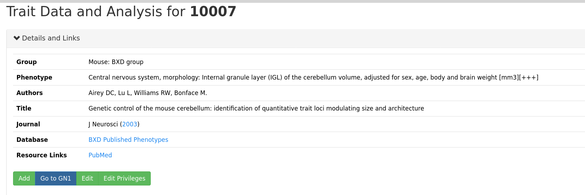

# Storyboard: Edit Metadata and sample data of published phenotypes

It's important to edit metadata to adhere to a certain standard
format.  In addition to that, researchers constantly want to modify
data from a given experiment without the constant nudging of the
database administrator. For published phenotypes, currently gn2
supports editing data, given that the user has the right access
privileges.

Before going any further, make sure you are signed in.

# Go to the traits and analysis page of your phenotype

In this page, if you have the right access privileges, you will see
the Edit button.

To go to the edits page, click that "Edit" button

# Edit the metadata

On the metadata page, you will presented with a form with which you
can use to edit the metadata.  Updating any of the field will update
the data.

[]

To view the updated history, click the "Update History" text.  You
will see your recent history:

[]

# Editing sample data

To download sample data, first download it, by clicking the "Sample
Data(CSV Download)" link:

[]

Edit this file in excel and make sure to save it in csv format.
Thereafter, you will be presented with a flash message that indicates
a successful upload:

[]

## View your diffs

Go to the [diffs page](https://genenetwork.org/datasets/diffs "diffs
page") where you will see your previous edits:

[]

If you the right curator access for a resource, you will see a
"reject" and "approve" button:

[]

Clicking one of the diffs will display the diff:

[]

## Approve and Reject the changes

If you have curator privileges over the resource, click the approve or
reject button depending on how satisfactory the changes are.

## Check the traits page

Finally, the data has been updated, and you can always go back to the
traits page to view the data.

